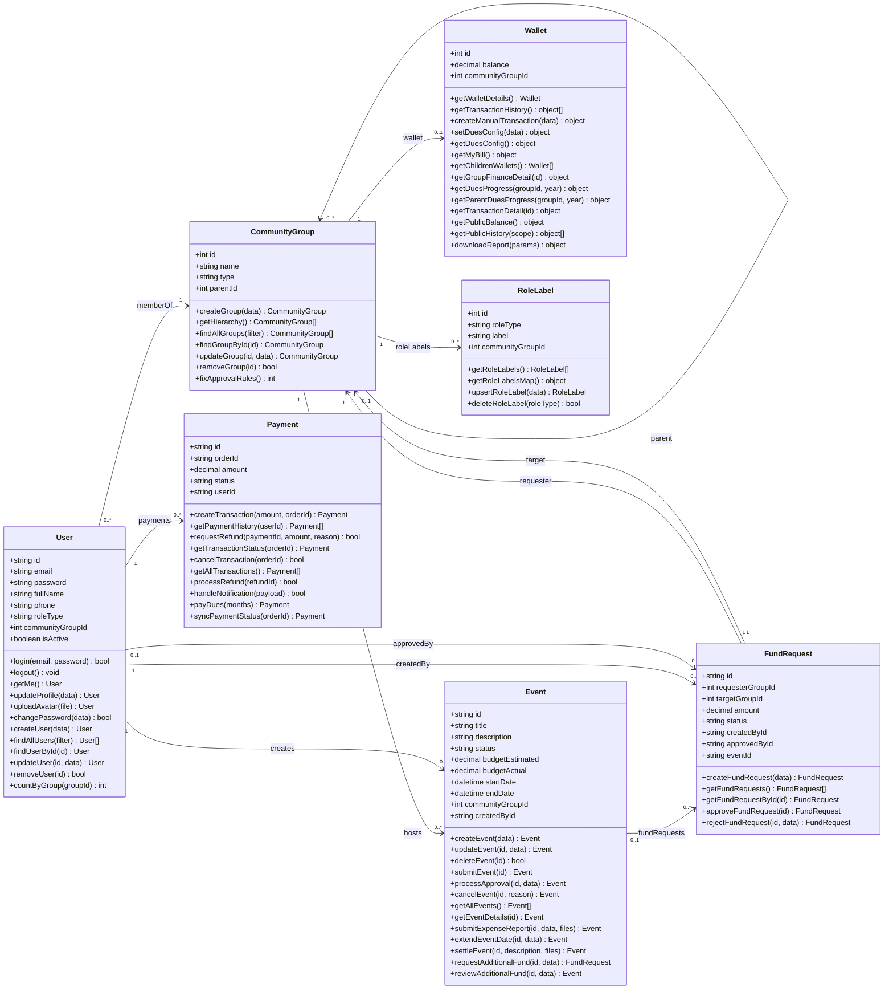

# Class Diagram (Ringkas)

```mermaid
classDiagram
  direction LR

  class User {
    +string id
    +string email
    +string password
    +string fullName
    +string phone
    +string roleType
    +int communityGroupId
    +boolean isActive
    +login(email, password) bool
    +logout() void
    +getMe() User
    +updateProfile(data) User
    +uploadAvatar(file) User
    +changePassword(data) bool
    +createUser(data) User
    +findAllUsers(filter) User[]
    +findUserById(id) User
    +updateUser(id, data) User
    +removeUser(id) bool
    +countByGroup(groupId) int
  }

  class CommunityGroup {
    +int id
    +string name
    +string type
    +int parentId
    +createGroup(data) CommunityGroup
    +getHierarchy() CommunityGroup[]
    +findAllGroups(filter) CommunityGroup[]
    +findGroupById(id) CommunityGroup
    +updateGroup(id, data) CommunityGroup
    +removeGroup(id) bool
    +fixApprovalRules() int
  }

  class Event {
    +string id
    +string title
    +string description
    +string status
    +decimal budgetEstimated
    +decimal budgetActual
    +datetime startDate
    +datetime endDate
    +int communityGroupId
    +string createdById
    +createEvent(data) Event
    +updateEvent(id, data) Event
    +deleteEvent(id) bool
    +submitEvent(id) Event
    +processApproval(id, data) Event
    +cancelEvent(id, reason) Event
    +getAllEvents() Event[]
    +getEventDetails(id) Event
    +submitExpenseReport(id, data, files) Event
    +extendEventDate(id, data) Event
    +settleEvent(id, description, files) Event
    +requestAdditionalFund(id, data) FundRequest
    +reviewAdditionalFund(id, data) Event
  }

  class FundRequest {
    +string id
    +int requesterGroupId
    +int targetGroupId
    +decimal amount
    +string status
    +string createdById
    +string approvedById
    +string eventId
    +createFundRequest(data) FundRequest
    +getFundRequests() FundRequest[]
    +getFundRequestById(id) FundRequest
    +approveFundRequest(id) FundRequest
    +rejectFundRequest(id, data) FundRequest
  }

  class Wallet {
    +int id
    +decimal balance
    +int communityGroupId
    +getWalletDetails() Wallet
    +getTransactionHistory() object[]
    +createManualTransaction(data) object
    +setDuesConfig(data) object
    +getDuesConfig() object
    +getMyBill() object
    +getChildrenWallets() Wallet[]
    +getGroupFinanceDetail(id) object
    +getDuesProgress(groupId, year) object
    +getParentDuesProgress(groupId, year) object
    +getTransactionDetail(id) object
    +getPublicBalance() object
    +getPublicHistory(scope) object[]
    +downloadReport(params) object
  }

  class Payment {
    +string id
    +string orderId
    +decimal amount
    +string status
    +string userId
    +createTransaction(amount, orderId) Payment
    +getPaymentHistory(userId) Payment[]
    +requestRefund(paymentId, amount, reason) bool
    +getTransactionStatus(orderId) Payment
    +cancelTransaction(orderId) bool
    +getAllTransactions() Payment[]
    +processRefund(refundId) bool
    +handleNotification(payload) bool
    +payDues(months) Payment
    +syncPaymentStatus(orderId) Payment
  }

  class RoleLabel {
    +int id
    +string roleType
    +string label
    +int communityGroupId
    +getRoleLabels() RoleLabel[]
    +getRoleLabelsMap() object
    +upsertRoleLabel(data) RoleLabel
    +deleteRoleLabel(roleType) bool
  }

  User "0..*" --> "1" CommunityGroup : memberOf
  CommunityGroup "0..1" --> "0..*" CommunityGroup : parent
  CommunityGroup "1" --> "0..1" Wallet : wallet
  CommunityGroup "1" --> "0..*" Event : hosts
  User "1" --> "0..*" Event : creates
  Event "0..1" --> "0..*" FundRequest : fundRequests
  User "1" --> "0..*" FundRequest : createdBy
  User "0..1" --> "0..*" FundRequest : approvedBy
  User "1" --> "0..*" Payment : payments
  CommunityGroup "1" --> "0..*" RoleLabel : roleLabels
  FundRequest "1" --> "1" CommunityGroup : requester
  FundRequest "1" --> "1" CommunityGroup : target
```