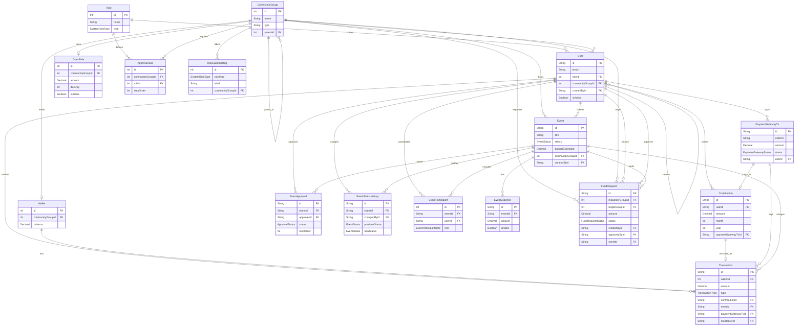

# ERD

```mermaid
erDiagram
  Role {
    Int id PK
    String name
    SystemRoleType type
  }
  CommunityGroup {
    Int id PK
    String name
    String type
    Int parentId FK
  }
  User {
    String id PK
    String email
    Int roleId FK
    Int communityGroupId FK
    String createdById FK
    Boolean isActive
  }
  Wallet {
    Int id PK
    Int communityGroupId FK
    Decimal balance
  }
  DuesRule {
    Int id PK
    Int communityGroupId FK
    Decimal amount
    Int dueDay
    Boolean isActive
  }
  Contribution {
    String id PK
    String userId FK
    Decimal amount
    Int month
    Int year
    String paymentGatewayTxId FK
  }
  Transaction {
    String id PK
    Int walletId FK
    Decimal amount
    TransactionType type
    String contributionId FK
    String eventId FK
    String paymentGatewayTxId FK
    String createdById FK
  }
  Event {
    String id PK
    String title
    EventStatus status
    Decimal budgetEstimated
    Int communityGroupId FK
    String createdById FK
  }
  ApprovalRule {
    Int id PK
    Int communityGroupId FK
    Int roleId FK
    Int stepOrder
  }
  EventApproval {
    String id PK
    String eventId FK
    String approverId FK
    ApprovalStatus status
    Int stepOrder
  }
  EventStatusHistory {
    String id PK
    String eventId FK
    String changedById FK
    EventStatus previousStatus
    EventStatus newStatus
  }
  EventParticipant {
    Int id PK
    String eventId FK
    String userId FK
    EventParticipantRole role
  }
  EventExpense {
    String id PK
    String eventId FK
    Decimal amount
    Boolean isValid
  }
  PaymentGatewayTx {
    String id PK
    String orderId
    Decimal amount
    PaymentGatewayStatus status
    String userId FK
  }
  FundRequest {
    String id PK
    Int requesterGroupId FK
    Int targetGroupId FK
    Decimal amount
    FundRequestStatus status
    String createdById FK
    String approvedById FK
    String eventId FK
  }
  RoleLabelSetting {
    Int id PK
    SystemRoleType roleType
    String label
    Int communityGroupId FK
  }

  Role ||--o{ User : has
  Role ||--o{ ApprovalRule : defines
  CommunityGroup ||--o{ User : has
  CommunityGroup ||--o| Wallet : wallet
  CommunityGroup ||--o| DuesRule : dues
  CommunityGroup ||--o{ ApprovalRule : requires
  CommunityGroup ||--o{ Event : hosts
  CommunityGroup ||--o{ FundRequest : requester
  CommunityGroup ||--o{ FundRequest : target
  CommunityGroup ||--o{ RoleLabelSetting : labels
  CommunityGroup ||--o{ CommunityGroup : parent_of
  User ||--o{ User : creates
  User ||--o{ Contribution : makes
  User ||--o{ Event : creates
  User ||--o{ EventApproval : approves
  User ||--o{ EventStatusHistory : changes
  User ||--o{ EventParticipant : participates
  User ||--o{ FundRequest : creates
  User ||--o{ FundRequest : approves
  User ||--o{ Transaction : creates
  User ||--o{ PaymentGatewayTx : pays
  Wallet ||--o{ Transaction : has
  Contribution ||--o| Transaction : recorded_as
  PaymentGatewayTx ||--o| Contribution : pays_for
  PaymentGatewayTx ||--o{ Transaction : logs
  Event ||--o{ EventApproval : needs
  Event ||--o{ EventExpense : has
  Event ||--o{ EventParticipant : includes
  Event ||--o{ EventStatusHistory : history
  Event ||--o{ FundRequest : funds
  Event ||--o{ Transaction : charges
```
