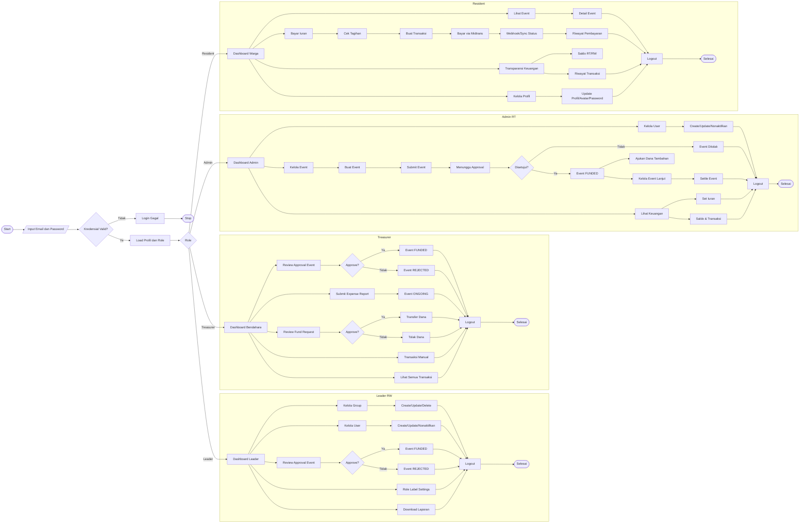

# Flowchart

```mermaid
flowchart LR
  Start([Start]) --> Input[/Input Email dan Password/]
  Input --> Valid{Kredensial Valid?}
  Valid -- Tidak --> LoginFail[Login Gagal]
  LoginFail --> StopFail([Stop])
  Valid -- Ya --> Load[Load Profil dan Role]
  Load --> Role{Role}

  subgraph Resident[Resident]
    direction TB
    RDash[Dashboard Warga]
    RDash --> REvents[Lihat Event]
    REvents --> RDetail[Detail Event]
    RDash --> RPay[Bayar Iuran]
    RPay --> RBill[Cek Tagihan]
    RBill --> RCreateTx[Buat Transaksi]
    RCreateTx --> RMidtrans[Bayar via Midtrans]
    RMidtrans --> RSync[Webhook/Sync Status]
    RSync --> RHistory[Riwayat Pembayaran]
    RDash --> RFinance[Transparansi Keuangan]
    RFinance --> RBalance[Saldo RT/RW]
    RFinance --> RTxHistory[Riwayat Transaksi]
    RDash --> RProfile[Kelola Profil]
    RProfile --> RUpdate[Update Profil/Avatar/Password]
    RDetail --> RLogout[Logout]
    RHistory --> RLogout
    RTxHistory --> RLogout
    RUpdate --> RLogout
    RLogout --> RStop([Selesai])
  end

  subgraph Admin[Admin RT]
    direction TB
    ADash[Dashboard Admin]
    ADash --> AUsers[Kelola User]
    AUsers --> AUserCRUD[Create/Update/Nonaktifkan]
    ADash --> AEvents[Kelola Event]
    AEvents --> ACreateEvent[Buat Event]
    ACreateEvent --> ASubmit[Submit Event]
    ASubmit --> AWait[Menunggu Approval]
    AWait --> AApproved{Disetujui?}
    AApproved -- Tidak --> ARejected[Event Ditolak]
    AApproved -- Ya --> AFunded[Event FUNDED]
    AFunded --> AReqExtra[Ajukan Dana Tambahan]
    AFunded --> AContinue[Kelola Event Lanjut]
    AContinue --> ASettle[Settle Event]
    ADash --> AFinance[Lihat Keuangan]
    AFinance --> ADues[Set Iuran]
    AFinance --> ATx[Saldo & Transaksi]
    AUserCRUD --> ALogout[Logout]
    ARejected --> ALogout
    ASettle --> ALogout
    ADues --> ALogout
    ATx --> ALogout
    ALogout --> AStop([Selesai])
  end

  subgraph Treasurer[Treasurer]
    direction TB
    TDash[Dashboard Bendahara]
    TDash --> TApprove[Review Approval Event]
    TApprove --> TDecision{Approve?}
    TDecision -- Ya --> TFund[Event FUNDED]
    TDecision -- Tidak --> TReject[Event REJECTED]
    TDash --> TExpense[Submit Expense Report]
    TExpense --> TOngoing[Event ONGOING]
    TDash --> TFundReq[Review Fund Request]
    TFundReq --> TFundDecision{Approve?}
    TFundDecision -- Ya --> TTransfer[Transfer Dana]
    TFundDecision -- Tidak --> TDecline[Tolak Dana]
    TDash --> TManual[Transaksi Manual]
    TDash --> TPayHistory[Lihat Semua Transaksi]
    TFund --> TLogout[Logout]
    TReject --> TLogout
    TOngoing --> TLogout
    TTransfer --> TLogout
    TDecline --> TLogout
    TManual --> TLogout
    TPayHistory --> TLogout
    TLogout --> TStop([Selesai])
  end

  subgraph Leader[Leader RW]
    direction TB
    LDash[Dashboard Leader]
    LDash --> LGroups[Kelola Group]
    LGroups --> LGroupCRUD[Create/Update/Delete]
    LDash --> LUsers[Kelola User]
    LUsers --> LUserCRUD[Create/Update/Nonaktifkan]
    LDash --> LApprove[Review Approval Event]
    LApprove --> LDecision{Approve?}
    LDecision -- Ya --> LFund[Event FUNDED]
    LDecision -- Tidak --> LReject[Event REJECTED]
    LDash --> LSettings[Role Label Settings]
    LDash --> LReport[Download Laporan]
    LGroupCRUD --> LLogout[Logout]
    LUserCRUD --> LLogout
    LFund --> LLogout
    LReject --> LLogout
    LSettings --> LLogout
    LReport --> LLogout
    LLogout --> LStop([Selesai])
  end

  Role -->|Resident| RDash
  Role -->|Admin| ADash
  Role -->|Treasurer| TDash
  Role -->|Leader| LDash
```
