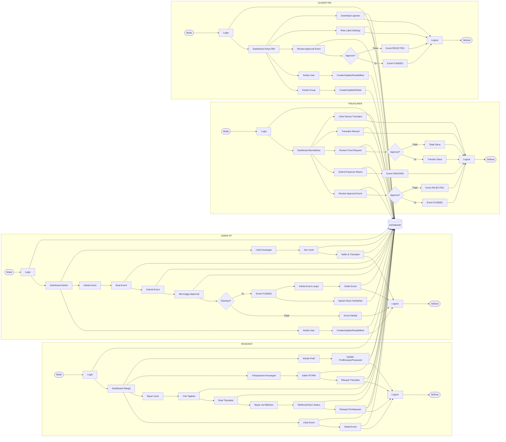

# Flowmap Usulan Sistem Event Organizer

```mermaid
flowchart LR
  DB[(DATABASE)]

  subgraph Resident[RESIDENT]
    direction TB
    RStart([Mulai])
    RLogin[Login]
    RHome[Dashboard Warga]
    REvents[Lihat Event]
    RDetail[Detail Event]
    RPay[Bayar Iuran]
    RBill[Cek Tagihan]
    RCreateTx[Buat Transaksi]
    RMidtrans[Bayar via Midtrans]
    RSync[Webhook/Sync Status]
    RHistory[Riwayat Pembayaran]
    RTransparency[Transparansi Keuangan]
    RBalance[Saldo RT/RW]
    RTxHistory[Riwayat Transaksi]
    RProfile[Kelola Profil]
    RUpdate[Update Profil/Avatar/Password]
    RLogout[Logout]
    RDone([Selesai])

    RStart --> RLogin --> RHome
    RHome --> REvents --> RDetail
    RHome --> RPay --> RBill --> RCreateTx --> RMidtrans --> RSync --> RHistory
    RHome --> RTransparency --> RBalance --> RTxHistory
    RHome --> RProfile --> RUpdate
    RDetail --> RLogout --> RDone
    RHistory --> RLogout
    RTxHistory --> RLogout
    RUpdate --> RLogout
  end

  subgraph Admin[ADMIN RT]
    direction TB
    AStart([Mulai])
    ALogin[Login]
    AHome[Dashboard Admin]
    AUsers[Kelola User]
    AUserCRUD[Create/Update/Nonaktifkan]
    AEvents[Kelola Event]
    ACreateEvent[Buat Event]
    ASubmit[Submit Event]
    AWait[Menunggu Approval]
    AApproved{Disetujui?}
    ARejected[Event Ditolak]
    AFunded[Event FUNDED]
    AExtra[Ajukan Dana Tambahan]
    AContinue[Kelola Event Lanjut]
    ASettle[Settle Event]
    AFinance[Lihat Keuangan]
    ADues[Atur Iuran]
    ATx[Saldo & Transaksi]
    ALogout[Logout]
    ADone([Selesai])

    AStart --> ALogin --> AHome
    AHome --> AUsers --> AUserCRUD
    AHome --> AEvents --> ACreateEvent --> ASubmit --> AWait --> AApproved
    AApproved -- Tidak --> ARejected --> ALogout
    AApproved -- Ya --> AFunded --> AExtra
    AFunded --> AContinue --> ASettle --> ALogout
    AHome --> AFinance --> ADues --> ATx
    AUserCRUD --> ALogout
    ATx --> ALogout --> ADone
  end

  subgraph Treasurer[TREASURER]
    direction TB
    TStart([Mulai])
    TLogin[Login]
    THome[Dashboard Bendahara]
    TApprove[Review Approval Event]
    TDecision{Approve?}
    TFund[Event FUNDED]
    TReject[Event REJECTED]
    TExpense[Submit Expense Report]
    TOngoing[Event ONGOING]
    TFundReq[Review Fund Request]
    TFundDecision{Approve?}
    TTransfer[Transfer Dana]
    TDecline[Tolak Dana]
    TManual[Transaksi Manual]
    TAllTx[Lihat Semua Transaksi]
    TLogout[Logout]
    TDone([Selesai])

    TStart --> TLogin --> THome
    THome --> TApprove --> TDecision
    TDecision -- Ya --> TFund
    TDecision -- Tidak --> TReject
    THome --> TExpense --> TOngoing
    THome --> TFundReq --> TFundDecision
    TFundDecision -- Ya --> TTransfer
    TFundDecision -- Tidak --> TDecline
    THome --> TManual
    THome --> TAllTx
    TFund --> TLogout
    TReject --> TLogout
    TOngoing --> TLogout
    TTransfer --> TLogout
    TDecline --> TLogout
    TManual --> TLogout
    TAllTx --> TLogout --> TDone
  end

  subgraph Leader[LEADER RW]
    direction TB
    LStart([Mulai])
    LLogin[Login]
    LHome[Dashboard Ketua RW]
    LGroups[Kelola Group]
    LGroupCRUD[Create/Update/Delete]
    LUsers[Kelola User]
    LUserCRUD[Create/Update/Nonaktifkan]
    LApprove[Review Approval Event]
    LDecision{Approve?}
    LFund[Event FUNDED]
    LReject[Event REJECTED]
    LLabels[Role Label Settings]
    LReport[Download Laporan]
    LLogout[Logout]
    LDone([Selesai])

    LStart --> LLogin --> LHome
    LHome --> LGroups --> LGroupCRUD
    LHome --> LUsers --> LUserCRUD
    LHome --> LApprove --> LDecision
    LDecision -- Ya --> LFund --> LLogout
    LDecision -- Tidak --> LReject --> LLogout
    LHome --> LLabels --> LLogout
    LHome --> LReport --> LLogout --> LDone
  end

  RLogin --> DB
  REvents --> DB
  RDetail --> DB
  RBill --> DB
  RCreateTx --> DB
  RSync --> DB
  RHistory --> DB
  RBalance --> DB
  RTxHistory --> DB
  RUpdate --> DB

  ALogin --> DB
  AUserCRUD --> DB
  ACreateEvent --> DB
  ASubmit --> DB
  AWait --> DB
  AExtra --> DB
  ASettle --> DB
  ADues --> DB
  ATx --> DB

  TLogin --> DB
  TApprove --> DB
  TExpense --> DB
  TFundReq --> DB
  TManual --> DB
  TAllTx --> DB

  LLogin --> DB
  LGroupCRUD --> DB
  LUserCRUD --> DB
  LApprove --> DB
  LLabels --> DB
  LReport --> DB
```
