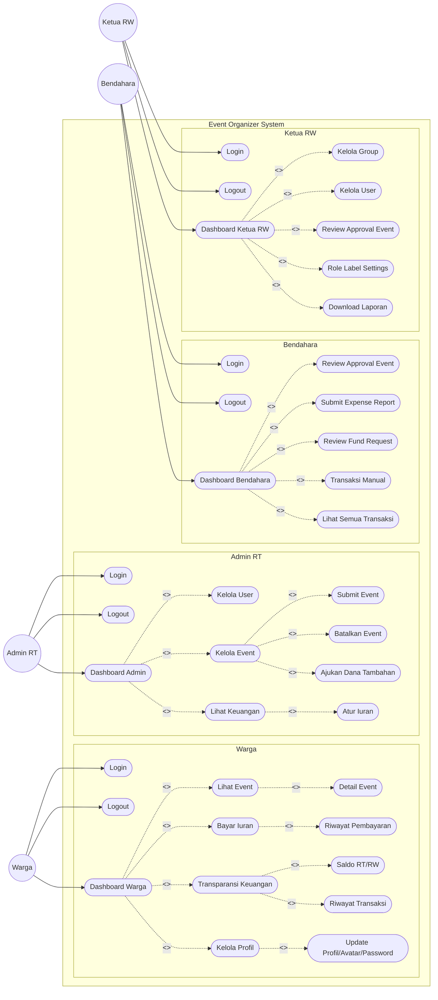

# Use Case Diagram

```mermaid
flowchart LR
  Warga((Warga))
  Admin((Admin RT))
  Treasurer((Bendahara))
  Leader((Ketua RW))

  subgraph System[Event Organizer System]
    direction LR

    subgraph W[Warga]
      direction TB
      WLogin([Login])
      WLogout([Logout])
      WDash([Dashboard Warga])
      WViewEvents([Lihat Event])
      WDetail([Detail Event])
      WPay([Bayar Iuran])
      WPayHistory([Riwayat Pembayaran])
      WTransparency([Transparansi Keuangan])
      WBalance([Saldo RT/RW])
      WHistory([Riwayat Transaksi])
      WProfile([Kelola Profil])
      WUpdate([Update Profil/Avatar/Password])
      WDash -.->|"<<include>>"| WViewEvents
      WViewEvents -.->|"<<include>>"| WDetail
      WDash -.->|"<<include>>"| WPay
      WPay -.->|"<<include>>"| WPayHistory
      WDash -.->|"<<include>>"| WTransparency
      WTransparency -.->|"<<include>>"| WBalance
      WTransparency -.->|"<<include>>"| WHistory
      WDash -.->|"<<include>>"| WProfile
      WProfile -.->|"<<include>>"| WUpdate
    end

    subgraph A[Admin RT]
      direction TB
      ALogin([Login])
      ALogout([Logout])
      ADash([Dashboard Admin])
      AUsers([Kelola User])
      AEvents([Kelola Event])
      ASubmit([Submit Event])
      ACancel([Batalkan Event])
      AExtra([Ajukan Dana Tambahan])
      AFinance([Lihat Keuangan])
      ADues([Atur Iuran])
      ADash -.->|"<<include>>"| AUsers
      ADash -.->|"<<include>>"| AEvents
      AEvents -.->|"<<include>>"| ASubmit
      AEvents -.->|"<<include>>"| ACancel
      AEvents -.->|"<<include>>"| AExtra
      ADash -.->|"<<include>>"| AFinance
      AFinance -.->|"<<include>>"| ADues
    end

    subgraph T[Bendahara]
      direction TB
      TLogin([Login])
      TLogout([Logout])
      TDash([Dashboard Bendahara])
      TApprove([Review Approval Event])
      TExpense([Submit Expense Report])
      TFund([Review Fund Request])
      TManual([Transaksi Manual])
      TAllTx([Lihat Semua Transaksi])
      TDash -.->|"<<include>>"| TApprove
      TDash -.->|"<<include>>"| TExpense
      TDash -.->|"<<include>>"| TFund
      TDash -.->|"<<include>>"| TManual
      TDash -.->|"<<include>>"| TAllTx
    end

    subgraph L[Ketua RW]
      direction TB
      LLogin([Login])
      LLogout([Logout])
      LDash([Dashboard Ketua RW])
      LGroups([Kelola Group])
      LUsers([Kelola User])
      LApprove([Review Approval Event])
      LLabels([Role Label Settings])
      LReport([Download Laporan])
      LDash -.->|"<<include>>"| LGroups
      LDash -.->|"<<include>>"| LUsers
      LDash -.->|"<<include>>"| LApprove
      LDash -.->|"<<include>>"| LLabels
      LDash -.->|"<<include>>"| LReport
    end
  end

  Warga --> WLogin
  Warga --> WLogout
  Warga --> WDash

  Admin --> ALogin
  Admin --> ALogout
  Admin --> ADash

  Treasurer --> TLogin
  Treasurer --> TLogout
  Treasurer --> TDash

  Leader --> LLogin
  Leader --> LLogout
  Leader --> LDash
```
