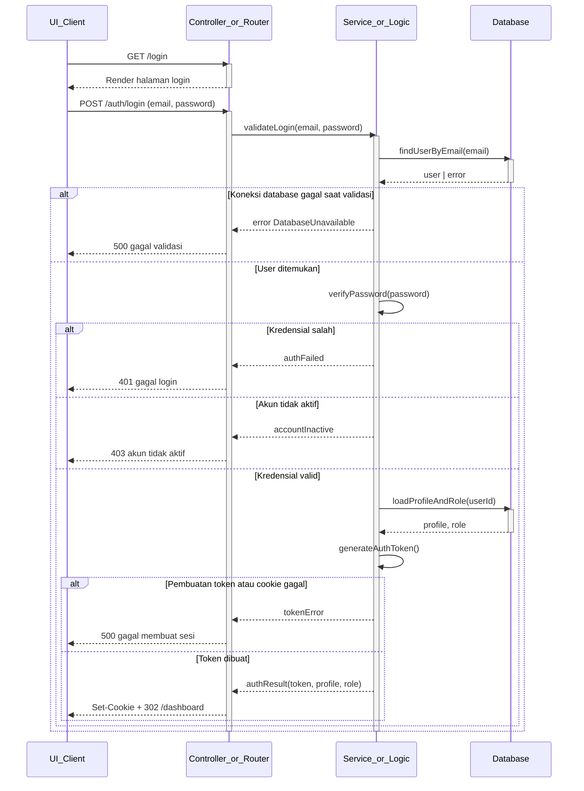

```mermaid
sequenceDiagram
    participant UI_Client
    participant Controller_or_Router
    participant Service_or_Logic
    participant Database

    UI_Client->>Controller_or_Router: GET /login
    activate Controller_or_Router
    Controller_or_Router-->>UI_Client: Render halaman login
    deactivate Controller_or_Router

    UI_Client->>Controller_or_Router: POST /auth/login (email, password)
    activate Controller_or_Router
    Controller_or_Router->>Service_or_Logic: validateLogin(email, password)
    activate Service_or_Logic
    Service_or_Logic->>Database: findUserByEmail(email)
    activate Database
    Database-->>Service_or_Logic: user | error
    deactivate Database

    alt Koneksi database gagal saat validasi
        Service_or_Logic-->>Controller_or_Router: error DatabaseUnavailable
        Controller_or_Router-->>UI_Client: 500 gagal validasi
    else User ditemukan
        Service_or_Logic->>Service_or_Logic: verifyPassword(password)
        alt Kredensial salah
            Service_or_Logic-->>Controller_or_Router: authFailed
            Controller_or_Router-->>UI_Client: 401 gagal login
        else Akun tidak aktif
            Service_or_Logic-->>Controller_or_Router: accountInactive
            Controller_or_Router-->>UI_Client: 403 akun tidak aktif
        else Kredensial valid
            Service_or_Logic->>Database: loadProfileAndRole(userId)
            activate Database
            Database-->>Service_or_Logic: profile, role
            deactivate Database
            Service_or_Logic->>Service_or_Logic: generateAuthToken()
            alt Pembuatan token atau cookie gagal
                Service_or_Logic-->>Controller_or_Router: tokenError
                Controller_or_Router-->>UI_Client: 500 gagal membuat sesi
            else Token dibuat
                Service_or_Logic-->>Controller_or_Router: authResult(token, profile, role)
                Controller_or_Router-->>UI_Client: Set-Cookie + 302 /dashboard
            end
        end
    end

    deactivate Service_or_Logic
    deactivate Controller_or_Router
```
