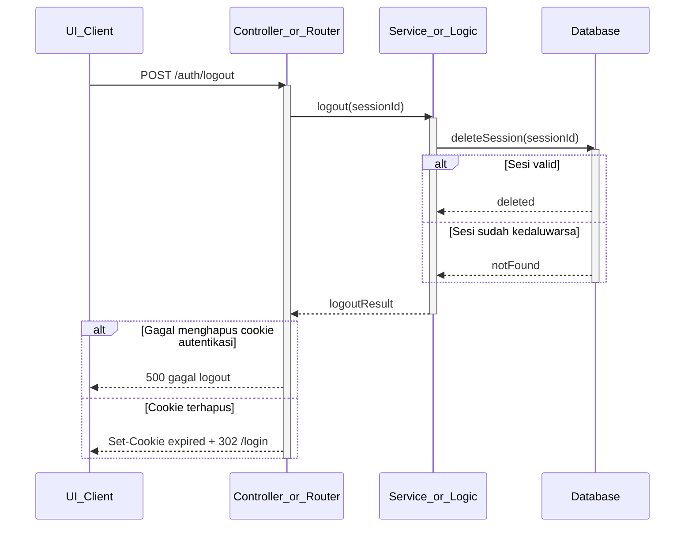

```mermaid
sequenceDiagram
    participant UI_Client
    participant Controller_or_Router
    participant Service_or_Logic
    participant Database

    UI_Client->>Controller_or_Router: POST /auth/logout
    activate Controller_or_Router
    Controller_or_Router->>Service_or_Logic: logout(sessionId)
    activate Service_or_Logic
    Service_or_Logic->>Database: deleteSession(sessionId)
    activate Database
    alt Sesi valid
        Database-->>Service_or_Logic: deleted
    else Sesi sudah kedaluwarsa
        Database-->>Service_or_Logic: notFound
    end
    deactivate Database
    Service_or_Logic-->>Controller_or_Router: logoutResult
    deactivate Service_or_Logic
    alt Gagal menghapus cookie autentikasi
        Controller_or_Router-->>UI_Client: 500 gagal logout
    else Cookie terhapus
        Controller_or_Router-->>UI_Client: Set-Cookie expired + 302 /login
    end
    deactivate Controller_or_Router
```
