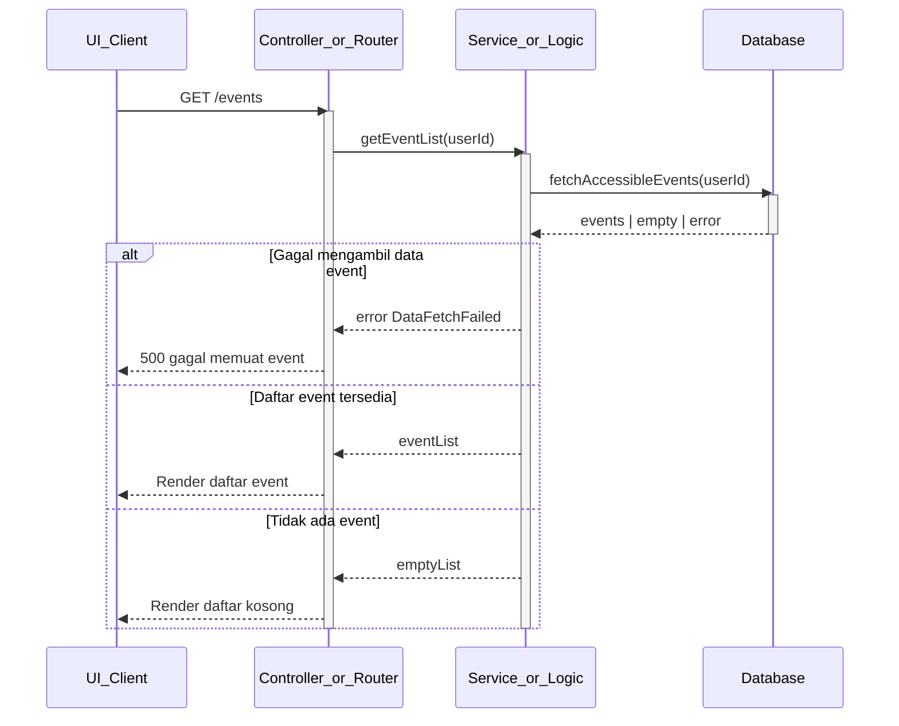

```mermaid
sequenceDiagram
    participant UI_Client
    participant Controller_or_Router
    participant Service_or_Logic
    participant Database

    UI_Client->>Controller_or_Router: GET /events
    activate Controller_or_Router
    Controller_or_Router->>Service_or_Logic: getEventList(userId)
    activate Service_or_Logic
    Service_or_Logic->>Database: fetchAccessibleEvents(userId)
    activate Database
    Database-->>Service_or_Logic: events | empty | error
    deactivate Database

    alt Gagal mengambil data event
        Service_or_Logic-->>Controller_or_Router: error DataFetchFailed
        Controller_or_Router-->>UI_Client: 500 gagal memuat event
    else Daftar event tersedia
        Service_or_Logic-->>Controller_or_Router: eventList
        Controller_or_Router-->>UI_Client: Render daftar event
    else Tidak ada event
        Service_or_Logic-->>Controller_or_Router: emptyList
        Controller_or_Router-->>UI_Client: Render daftar kosong
    end

    deactivate Service_or_Logic
    deactivate Controller_or_Router
```
