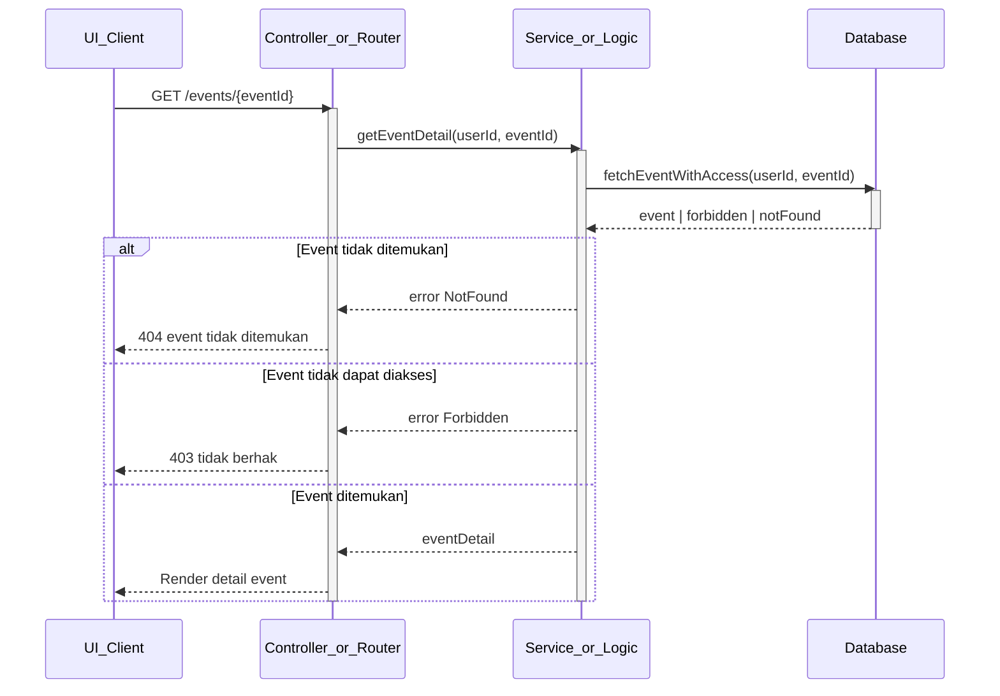

```mermaid
sequenceDiagram
    participant UI_Client
    participant Controller_or_Router
    participant Service_or_Logic
    participant Database

    UI_Client->>Controller_or_Router: GET /events/{eventId}
    activate Controller_or_Router
    Controller_or_Router->>Service_or_Logic: getEventDetail(userId, eventId)
    activate Service_or_Logic
    Service_or_Logic->>Database: fetchEventWithAccess(userId, eventId)
    activate Database
    Database-->>Service_or_Logic: event | forbidden | notFound
    deactivate Database

    alt Event tidak ditemukan
        Service_or_Logic-->>Controller_or_Router: error NotFound
        Controller_or_Router-->>UI_Client: 404 event tidak ditemukan
    else Event tidak dapat diakses
        Service_or_Logic-->>Controller_or_Router: error Forbidden
        Controller_or_Router-->>UI_Client: 403 tidak berhak
    else Event ditemukan
        Service_or_Logic-->>Controller_or_Router: eventDetail
        Controller_or_Router-->>UI_Client: Render detail event
    end

    deactivate Service_or_Logic
    deactivate Controller_or_Router
```
