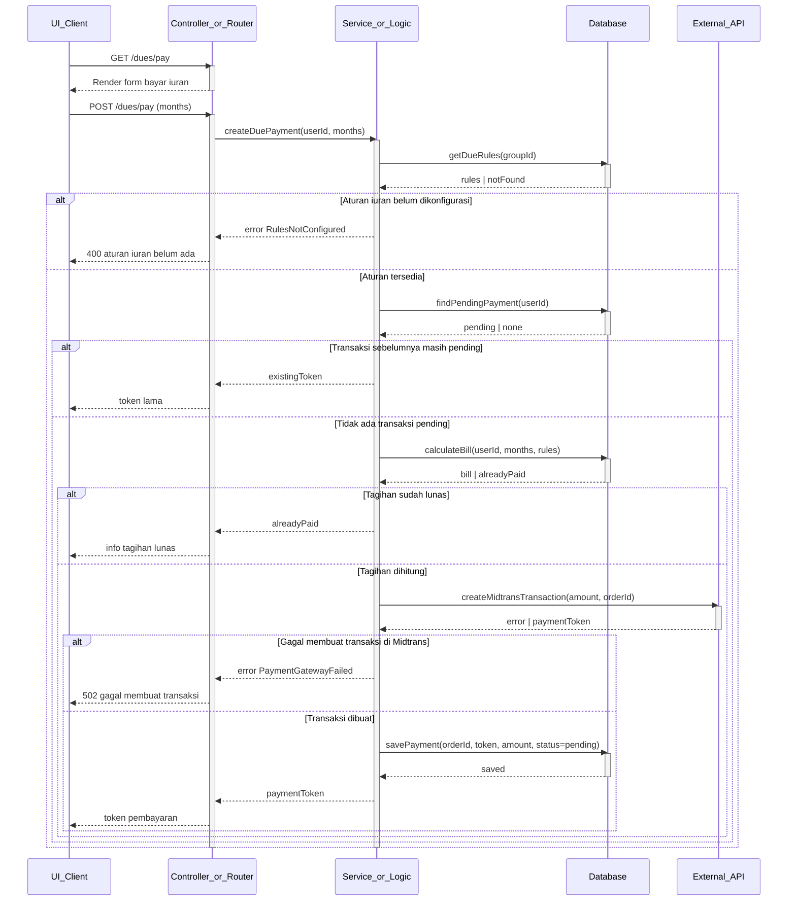

```mermaid
sequenceDiagram
    participant UI_Client
    participant Controller_or_Router
    participant Service_or_Logic
    participant Database
    participant External_API

    UI_Client->>Controller_or_Router: GET /dues/pay
    activate Controller_or_Router
    Controller_or_Router-->>UI_Client: Render form bayar iuran
    deactivate Controller_or_Router

    UI_Client->>Controller_or_Router: POST /dues/pay (months)
    activate Controller_or_Router
    Controller_or_Router->>Service_or_Logic: createDuePayment(userId, months)
    activate Service_or_Logic
    Service_or_Logic->>Database: getDueRules(groupId)
    activate Database
    Database-->>Service_or_Logic: rules | notFound
    deactivate Database

    alt Aturan iuran belum dikonfigurasi
        Service_or_Logic-->>Controller_or_Router: error RulesNotConfigured
        Controller_or_Router-->>UI_Client: 400 aturan iuran belum ada
    else Aturan tersedia
        Service_or_Logic->>Database: findPendingPayment(userId)
        activate Database
        Database-->>Service_or_Logic: pending | none
        deactivate Database
        alt Transaksi sebelumnya masih pending
            Service_or_Logic-->>Controller_or_Router: existingToken
            Controller_or_Router-->>UI_Client: token lama
        else Tidak ada transaksi pending
            Service_or_Logic->>Database: calculateBill(userId, months, rules)
            activate Database
            Database-->>Service_or_Logic: bill | alreadyPaid
            deactivate Database
            alt Tagihan sudah lunas
                Service_or_Logic-->>Controller_or_Router: alreadyPaid
                Controller_or_Router-->>UI_Client: info tagihan lunas
            else Tagihan dihitung
                Service_or_Logic->>External_API: createMidtransTransaction(amount, orderId)
                activate External_API
                External_API-->>Service_or_Logic: error | paymentToken
                deactivate External_API
                alt Gagal membuat transaksi di Midtrans
                    Service_or_Logic-->>Controller_or_Router: error PaymentGatewayFailed
                    Controller_or_Router-->>UI_Client: 502 gagal membuat transaksi
                else Transaksi dibuat
                    Service_or_Logic->>Database: savePayment(orderId, token, amount, status=pending)
                    activate Database
                    Database-->>Service_or_Logic: saved
                    deactivate Database
                    Service_or_Logic-->>Controller_or_Router: paymentToken
                    Controller_or_Router-->>UI_Client: token pembayaran
                end
            end
        end
    end

    deactivate Service_or_Logic
    deactivate Controller_or_Router
```
