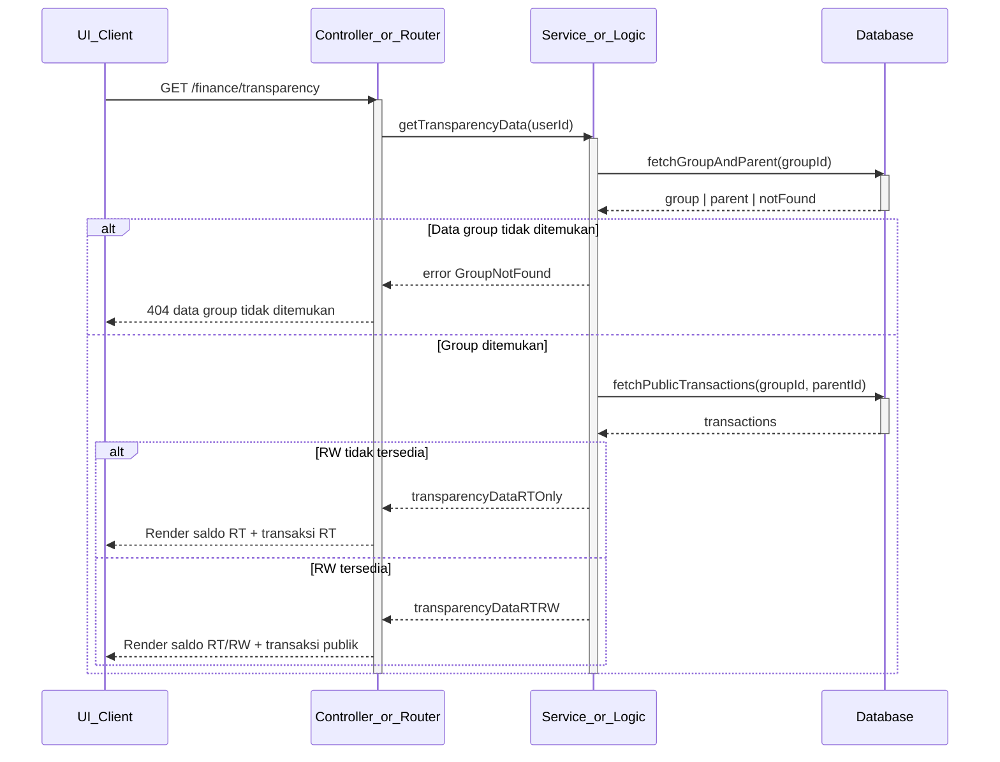

```mermaid
sequenceDiagram
    participant UI_Client
    participant Controller_or_Router
    participant Service_or_Logic
    participant Database

    UI_Client->>Controller_or_Router: GET /finance/transparency
    activate Controller_or_Router
    Controller_or_Router->>Service_or_Logic: getTransparencyData(userId)
    activate Service_or_Logic
    Service_or_Logic->>Database: fetchGroupAndParent(groupId)
    activate Database
    Database-->>Service_or_Logic: group | parent | notFound
    deactivate Database

    alt Data group tidak ditemukan
        Service_or_Logic-->>Controller_or_Router: error GroupNotFound
        Controller_or_Router-->>UI_Client: 404 data group tidak ditemukan
    else Group ditemukan
        Service_or_Logic->>Database: fetchPublicTransactions(groupId, parentId)
        activate Database
        Database-->>Service_or_Logic: transactions
        deactivate Database
        alt RW tidak tersedia
            Service_or_Logic-->>Controller_or_Router: transparencyDataRTOnly
            Controller_or_Router-->>UI_Client: Render saldo RT + transaksi RT
        else RW tersedia
            Service_or_Logic-->>Controller_or_Router: transparencyDataRTRW
            Controller_or_Router-->>UI_Client: Render saldo RT/RW + transaksi publik
        end
    end

    deactivate Service_or_Logic
    deactivate Controller_or_Router
```
