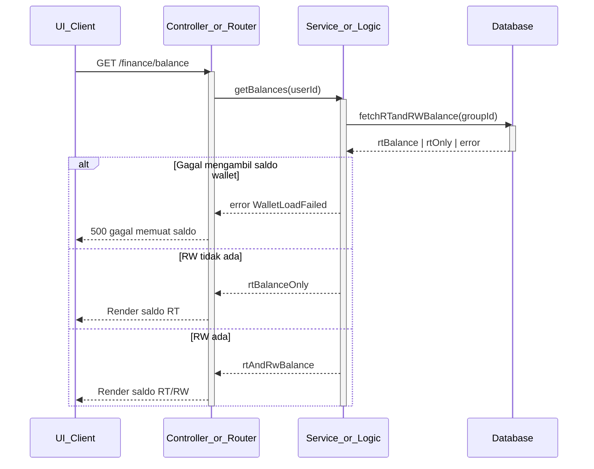

```mermaid
sequenceDiagram
    participant UI_Client
    participant Controller_or_Router
    participant Service_or_Logic
    participant Database

    UI_Client->>Controller_or_Router: GET /finance/balance
    activate Controller_or_Router
    Controller_or_Router->>Service_or_Logic: getBalances(userId)
    activate Service_or_Logic
    Service_or_Logic->>Database: fetchRTandRWBalance(groupId)
    activate Database
    Database-->>Service_or_Logic: rtBalance | rtOnly | error
    deactivate Database

    alt Gagal mengambil saldo wallet
        Service_or_Logic-->>Controller_or_Router: error WalletLoadFailed
        Controller_or_Router-->>UI_Client: 500 gagal memuat saldo
    else RW tidak ada
        Service_or_Logic-->>Controller_or_Router: rtBalanceOnly
        Controller_or_Router-->>UI_Client: Render saldo RT
    else RW ada
        Service_or_Logic-->>Controller_or_Router: rtAndRwBalance
        Controller_or_Router-->>UI_Client: Render saldo RT/RW
    end

    deactivate Service_or_Logic
    deactivate Controller_or_Router
```
