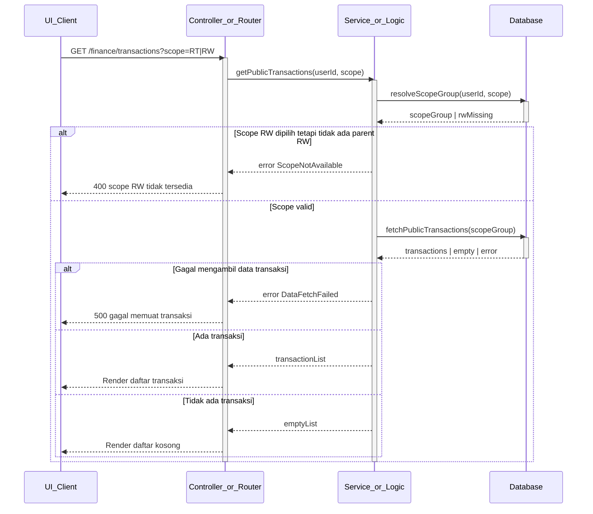

```mermaid
sequenceDiagram
    participant UI_Client
    participant Controller_or_Router
    participant Service_or_Logic
    participant Database

    UI_Client->>Controller_or_Router: GET /finance/transactions?scope=RT|RW
    activate Controller_or_Router
    Controller_or_Router->>Service_or_Logic: getPublicTransactions(userId, scope)
    activate Service_or_Logic
    Service_or_Logic->>Database: resolveScopeGroup(userId, scope)
    activate Database
    Database-->>Service_or_Logic: scopeGroup | rwMissing
    deactivate Database

    alt Scope RW dipilih tetapi tidak ada parent RW
        Service_or_Logic-->>Controller_or_Router: error ScopeNotAvailable
        Controller_or_Router-->>UI_Client: 400 scope RW tidak tersedia
    else Scope valid
        Service_or_Logic->>Database: fetchPublicTransactions(scopeGroup)
        activate Database
        Database-->>Service_or_Logic: transactions | empty | error
        deactivate Database
        alt Gagal mengambil data transaksi
            Service_or_Logic-->>Controller_or_Router: error DataFetchFailed
            Controller_or_Router-->>UI_Client: 500 gagal memuat transaksi
        else Ada transaksi
            Service_or_Logic-->>Controller_or_Router: transactionList
            Controller_or_Router-->>UI_Client: Render daftar transaksi
        else Tidak ada transaksi
            Service_or_Logic-->>Controller_or_Router: emptyList
            Controller_or_Router-->>UI_Client: Render daftar kosong
        end
    end

    deactivate Service_or_Logic
    deactivate Controller_or_Router
```
