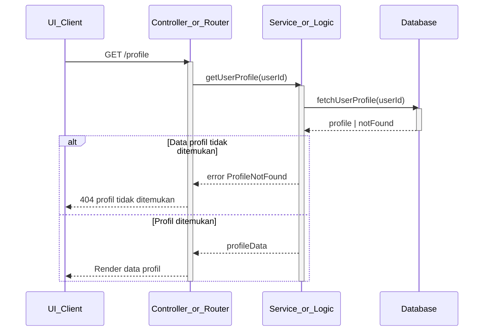

```mermaid
sequenceDiagram
    participant UI_Client
    participant Controller_or_Router
    participant Service_or_Logic
    participant Database

    UI_Client->>Controller_or_Router: GET /profile
    activate Controller_or_Router
    Controller_or_Router->>Service_or_Logic: getUserProfile(userId)
    activate Service_or_Logic
    Service_or_Logic->>Database: fetchUserProfile(userId)
    activate Database
    Database-->>Service_or_Logic: profile | notFound
    deactivate Database

    alt Data profil tidak ditemukan
        Service_or_Logic-->>Controller_or_Router: error ProfileNotFound
        Controller_or_Router-->>UI_Client: 404 profil tidak ditemukan
    else Profil ditemukan
        Service_or_Logic-->>Controller_or_Router: profileData
        Controller_or_Router-->>UI_Client: Render data profil
    end

    deactivate Service_or_Logic
    deactivate Controller_or_Router
```
