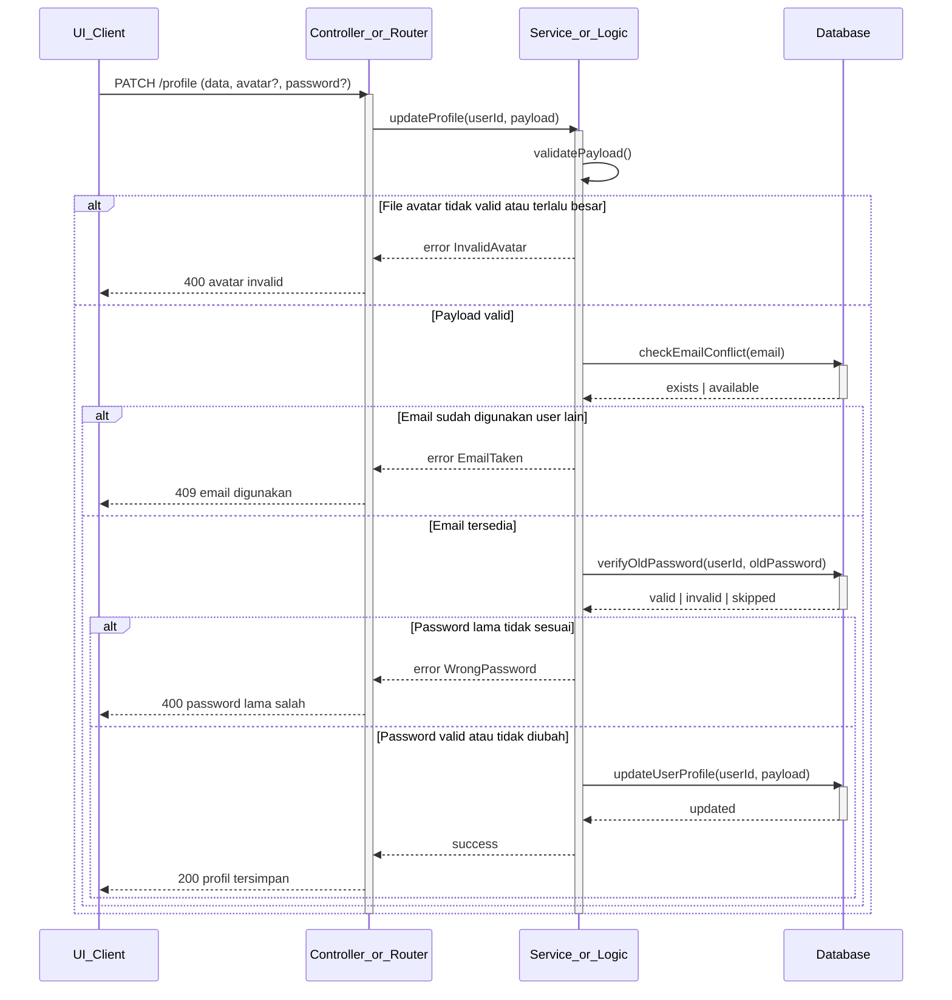

```mermaid
sequenceDiagram
    participant UI_Client
    participant Controller_or_Router
    participant Service_or_Logic
    participant Database

    UI_Client->>Controller_or_Router: PATCH /profile (data, avatar?, password?)
    activate Controller_or_Router
    Controller_or_Router->>Service_or_Logic: updateProfile(userId, payload)
    activate Service_or_Logic
    Service_or_Logic->>Service_or_Logic: validatePayload()

    alt File avatar tidak valid atau terlalu besar
        Service_or_Logic-->>Controller_or_Router: error InvalidAvatar
        Controller_or_Router-->>UI_Client: 400 avatar invalid
    else Payload valid
        Service_or_Logic->>Database: checkEmailConflict(email)
        activate Database
        Database-->>Service_or_Logic: exists | available
        deactivate Database
        alt Email sudah digunakan user lain
            Service_or_Logic-->>Controller_or_Router: error EmailTaken
            Controller_or_Router-->>UI_Client: 409 email digunakan
        else Email tersedia
            Service_or_Logic->>Database: verifyOldPassword(userId, oldPassword)
            activate Database
            Database-->>Service_or_Logic: valid | invalid | skipped
            deactivate Database
            alt Password lama tidak sesuai
                Service_or_Logic-->>Controller_or_Router: error WrongPassword
                Controller_or_Router-->>UI_Client: 400 password lama salah
            else Password valid atau tidak diubah
                Service_or_Logic->>Database: updateUserProfile(userId, payload)
                activate Database
                Database-->>Service_or_Logic: updated
                deactivate Database
                Service_or_Logic-->>Controller_or_Router: success
                Controller_or_Router-->>UI_Client: 200 profil tersimpan
            end
        end
    end

    deactivate Service_or_Logic
    deactivate Controller_or_Router
```
