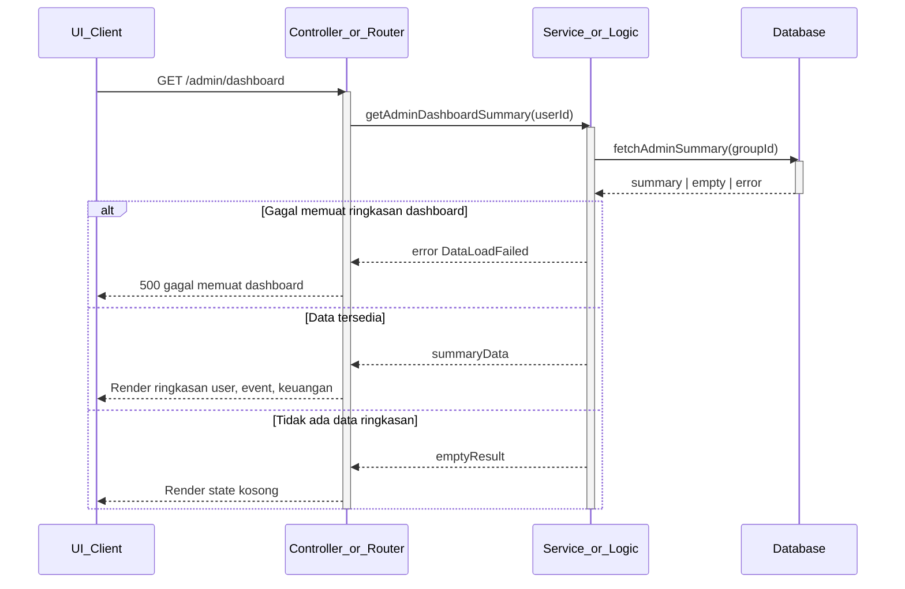

```mermaid
sequenceDiagram
    participant UI_Client
    participant Controller_or_Router
    participant Service_or_Logic
    participant Database

    UI_Client->>Controller_or_Router: GET /admin/dashboard
    activate Controller_or_Router
    Controller_or_Router->>Service_or_Logic: getAdminDashboardSummary(userId)
    activate Service_or_Logic
    Service_or_Logic->>Database: fetchAdminSummary(groupId)
    activate Database
    Database-->>Service_or_Logic: summary | empty | error
    deactivate Database

    alt Gagal memuat ringkasan dashboard
        Service_or_Logic-->>Controller_or_Router: error DataLoadFailed
        Controller_or_Router-->>UI_Client: 500 gagal memuat dashboard
    else Data tersedia
        Service_or_Logic-->>Controller_or_Router: summaryData
        Controller_or_Router-->>UI_Client: Render ringkasan user, event, keuangan
    else Tidak ada data ringkasan
        Service_or_Logic-->>Controller_or_Router: emptyResult
        Controller_or_Router-->>UI_Client: Render state kosong
    end

    deactivate Service_or_Logic
    deactivate Controller_or_Router
```
