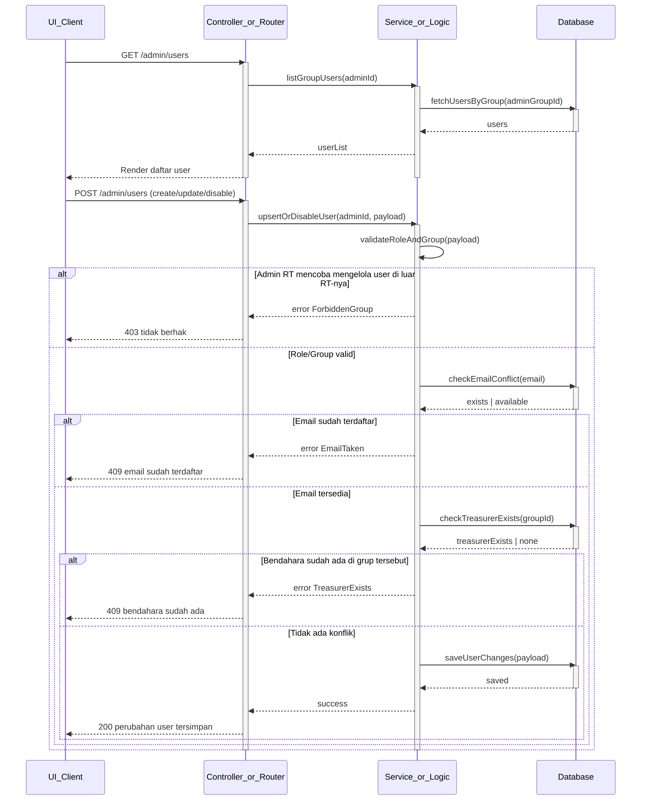

```mermaid
sequenceDiagram
    participant UI_Client
    participant Controller_or_Router
    participant Service_or_Logic
    participant Database

    UI_Client->>Controller_or_Router: GET /admin/users
    activate Controller_or_Router
    Controller_or_Router->>Service_or_Logic: listGroupUsers(adminId)
    activate Service_or_Logic
    Service_or_Logic->>Database: fetchUsersByGroup(adminGroupId)
    activate Database
    Database-->>Service_or_Logic: users
    deactivate Database
    Service_or_Logic-->>Controller_or_Router: userList
    Controller_or_Router-->>UI_Client: Render daftar user
    deactivate Service_or_Logic
    deactivate Controller_or_Router

    UI_Client->>Controller_or_Router: POST /admin/users (create/update/disable)
    activate Controller_or_Router
    Controller_or_Router->>Service_or_Logic: upsertOrDisableUser(adminId, payload)
    activate Service_or_Logic
    Service_or_Logic->>Service_or_Logic: validateRoleAndGroup(payload)

    alt Admin RT mencoba mengelola user di luar RT-nya
        Service_or_Logic-->>Controller_or_Router: error ForbiddenGroup
        Controller_or_Router-->>UI_Client: 403 tidak berhak
    else Role/Group valid
        Service_or_Logic->>Database: checkEmailConflict(email)
        activate Database
        Database-->>Service_or_Logic: exists | available
        deactivate Database
        alt Email sudah terdaftar
            Service_or_Logic-->>Controller_or_Router: error EmailTaken
            Controller_or_Router-->>UI_Client: 409 email sudah terdaftar
        else Email tersedia
            Service_or_Logic->>Database: checkTreasurerExists(groupId)
            activate Database
            Database-->>Service_or_Logic: treasurerExists | none
            deactivate Database
            alt Bendahara sudah ada di grup tersebut
                Service_or_Logic-->>Controller_or_Router: error TreasurerExists
                Controller_or_Router-->>UI_Client: 409 bendahara sudah ada
            else Tidak ada konflik
                Service_or_Logic->>Database: saveUserChanges(payload)
                activate Database
                Database-->>Service_or_Logic: saved
                deactivate Database
                Service_or_Logic-->>Controller_or_Router: success
                Controller_or_Router-->>UI_Client: 200 perubahan user tersimpan
            end
        end
    end

    deactivate Service_or_Logic
    deactivate Controller_or_Router
```
